# FitPass Gym Management
# Documento Único — Casos de Uso e Diagramas de Atividade

**Aluno:** Maycon Gabriel da Silva Morelli (24001786)
**Disciplina:** Engenharia de Software | **Professor:** Marcelo Marud | **UNIFEOB — 2026**

---

## Índice

| # | Caso de Uso | Ator Principal |
|---|---|---|
| UC01 | [Cadastrar Aluno](#uc01--cadastrar-aluno) | Recepcionista |
| UC02 | [Atualizar Dados do Aluno](#uc02--atualizar-dados-do-aluno) | Recepcionista |
| UC03 | [Criar Plano](#uc03--criar-plano) | Gerente |
| UC04 | [Editar Plano](#uc04--editar-plano) | Gerente |
| UC05 | [Registrar Pagamento](#uc05--registrar-pagamento) | Recepcionista |
| UC06 | [Verificar Regularidade](#uc06--verificar-regularidade) | Sistema |
| UC07 | [Liberar Acesso na Catraca](#uc07--liberar-acesso-na-catraca) | Aluno |
| UC08 | [Visualizar Aulas](#uc08--visualizar-aulas) | Aluno |
| UC09 | [Agendar Aula](#uc09--agendar-aula) | Aluno |
| UC10 | [Cancelar Agendamento](#uc10--cancelar-agendamento) | Aluno |
| UC11 | [Registrar Presença](#uc11--registrar-presença) | Instrutor |
| UC12 | [Visualizar Lista de Presença](#uc12--visualizar-lista-de-presença) | Instrutor |
| UC13 | [Registrar Avaliação Física](#uc13--registrar-avaliação-física) | Instrutor |
| UC14 | [Consultar Avaliação Física](#uc14--consultar-avaliação-física) | Instrutor |
| UC15 | [Gerar Relatório de Alunos](#uc15--gerar-relatório-de-alunos) | Gerente |
| UC16 | [Gerar Relatório de Inadimplência](#uc16--gerar-relatório-de-inadimplência) | Gerente |
| UC17 | [Gerar Relatório de Acessos](#uc17--gerar-relatório-de-acessos) | Gerente |
| UC18 | [Enviar Notificação de Pagamento](#uc18--enviar-notificação-de-pagamento) | Sistema |
| UC19 | [Enviar Confirmação de Aula](#uc19--enviar-confirmação-de-aula) | Sistema |
| UC20 | [Notificar Nova Avaliação Física](#uc20--notificar-nova-avaliação-física) | Sistema |

---

## Diagrama de Casos de Uso

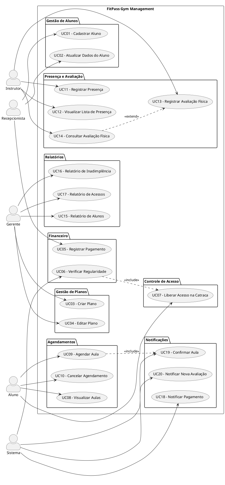

---

## UC01 — Cadastrar Aluno

| Atributo | Descrição |
|---|---|
| **Ator Principal** | Recepcionista |
| **Objetivo** | Cadastrar um novo aluno no sistema. |
| **Pré-condições** | Recepcionista autenticado. |
| **Pós-condições** | Aluno registrado no sistema. |
| **RF Relacionados** | RF01 |
| **RNF Relacionados** | RNF04 |
| **RN Relacionadas** | RN06 |

**Fluxo Principal:**
1. O recepcionista acessa a opção de cadastro.
2. O sistema solicita os dados do aluno.
3. O recepcionista preenche as informações.
4. O sistema salva o cadastro.

**Fluxos Alternativos:**
- **A1 — Dados incompletos:** O sistema solicita correção.

### Diagrama de Atividade

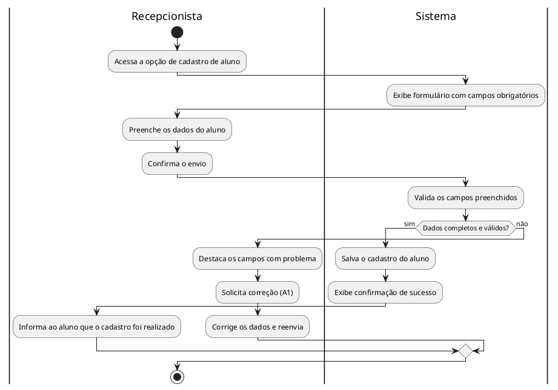

---

## UC02 — Atualizar Dados do Aluno

| Atributo | Descrição |
|---|---|
| **Ator Principal** | Recepcionista |
| **Objetivo** | Atualizar informações de um aluno já cadastrado. |
| **Pré-condições** | Aluno já cadastrado no sistema. |
| **Pós-condições** | Dados do aluno atualizados. |
| **RF Relacionados** | RF01 |
| **RNF Relacionados** | RNF04 |
| **RN Relacionadas** | RN06 |

**Fluxo Principal:**
1. O recepcionista busca o aluno.
2. O sistema mostra os dados atuais.
3. O recepcionista altera as informações.
4. O sistema salva as alterações.

**Fluxos Alternativos:**
- **A1 — Aluno não encontrado:** O sistema informa erro.

### Diagrama de Atividade

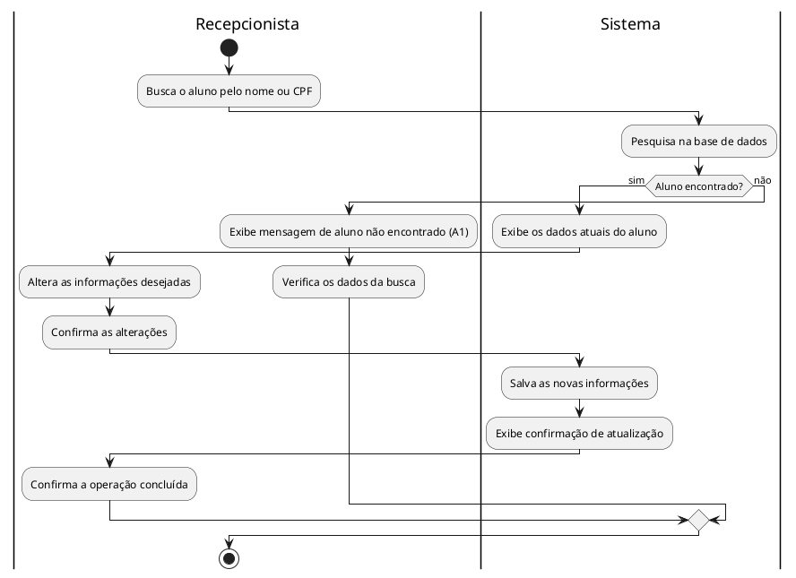

---

## UC03 — Criar Plano

| Atributo | Descrição |
|---|---|
| **Ator Principal** | Gerente |
| **Objetivo** | Criar um novo plano de academia. |
| **Pré-condições** | Gerente autenticado no sistema. |
| **Pós-condições** | Novo plano cadastrado e disponível. |
| **RF Relacionados** | RF02 |
| **RNF Relacionados** | RNF04 |
| **RN Relacionadas** | RN06 |

**Fluxo Principal:**
1. O gerente acessa a área de planos.
2. O gerente informa os dados do plano.
3. O sistema salva o plano.

**Fluxos Alternativos:**
- **A1 — Dados inválidos:** O sistema solicita correção.

### Diagrama de Atividade

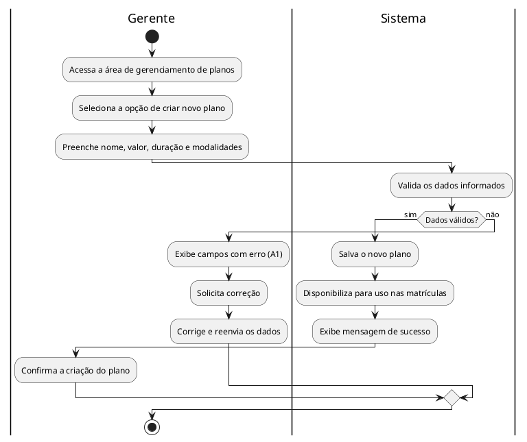

---

## UC04 — Editar Plano

| Atributo | Descrição |
|---|---|
| **Ator Principal** | Gerente |
| **Objetivo** | Modificar informações de um plano existente. |
| **Pré-condições** | Plano já cadastrado no sistema. |
| **Pós-condições** | Plano atualizado com as novas informações. |
| **RF Relacionados** | RF02 |
| **RNF Relacionados** | RNF04 |
| **RN Relacionadas** | RN06 |

**Fluxo Principal:**
1. O gerente seleciona o plano.
2. O sistema mostra as informações.
3. O gerente altera os dados.
4. O sistema salva as alterações.

**Fluxos Alternativos:**
- **A1 — Plano inexistente:** O sistema informa erro.

### Diagrama de Atividade

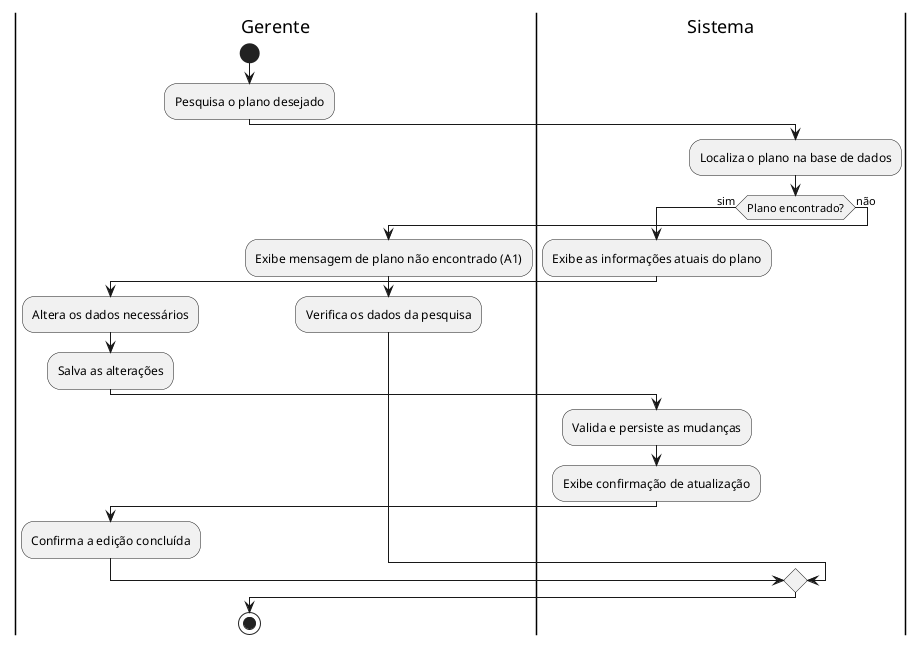

---

## UC05 — Registrar Pagamento

| Atributo | Descrição |
|---|---|
| **Ator Principal** | Recepcionista |
| **Objetivo** | Registrar o pagamento da mensalidade de um aluno. |
| **Pré-condições** | Aluno cadastrado no sistema. |
| **Pós-condições** | Pagamento registrado e situação do aluno atualizada. |
| **RF Relacionados** | RF03 |
| **RNF Relacionados** | RNF02 |
| **RN Relacionadas** | RN04, RN07 |

**Fluxo Principal:**
1. O recepcionista busca o aluno.
2. O sistema mostra a mensalidade.
3. O recepcionista confirma o pagamento.
4. O sistema registra o pagamento.

**Fluxos Alternativos:**
- **A1 — Falha no pagamento:** O sistema cancela a operação.

### Diagrama de Atividade

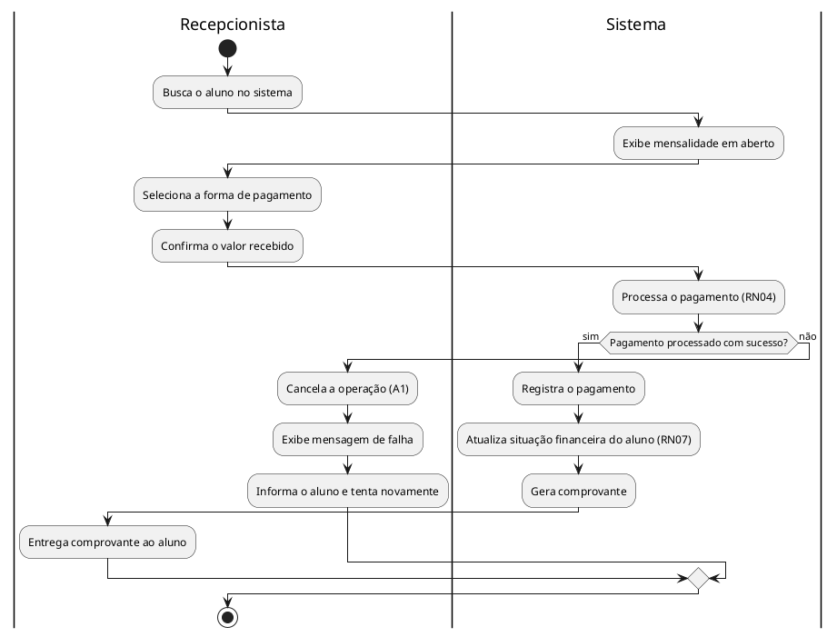

---

## UC06 — Verificar Regularidade

| Atributo | Descrição |
|---|---|
| **Ator Principal** | Sistema |
| **Objetivo** | Verificar se o aluno está com o pagamento em dia. |
| **Pré-condições** | Aluno cadastrado no sistema. |
| **Pós-condições** | Situação financeira do aluno atualizada. |
| **RF Relacionados** | RF04 |
| **RNF Relacionados** | RNF03 |
| **RN Relacionadas** | RN01 |

**Fluxo Principal:**
1. O sistema verifica a data de pagamento.
2. O sistema define a situação do aluno.

**Fluxos Alternativos:**
- **A1 — Mensalidade vencida:** O sistema marca como inadimplente.

### Diagrama de Atividade

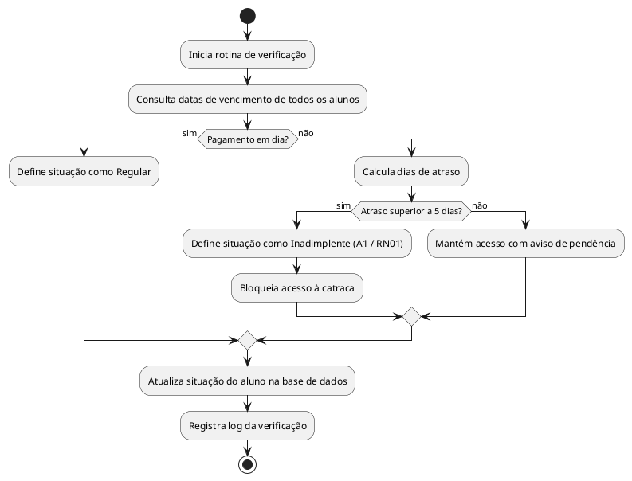

---

## UC07 — Liberar Acesso na Catraca

| Atributo | Descrição |
|---|---|
| **Ator Principal** | Aluno |
| **Objetivo** | Entrar na academia utilizando RFID. |
| **Pré-condições** | Aluno com plano ativo. |
| **Pós-condições** | Entrada liberada ou bloqueada conforme situação. |
| **RF Relacionados** | RF05 |
| **RNF Relacionados** | RNF03, RNF06 |
| **RN Relacionadas** | RN01 |

**Fluxo Principal:**
1. O aluno aproxima o cartão.
2. O sistema valida o cadastro.
3. O sistema libera o acesso.

**Fluxos Alternativos:**
- **A1 — Aluno inadimplente:** A catraca permanece bloqueada.

### Diagrama de Atividade

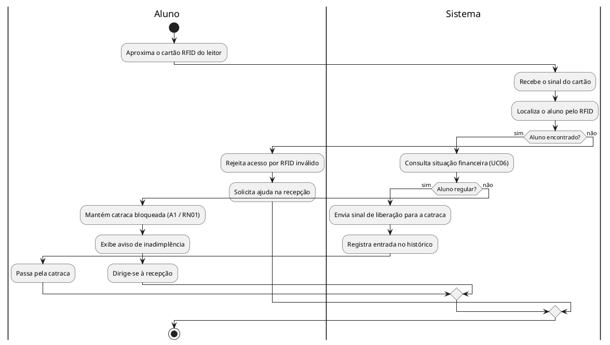

---

## UC08 — Visualizar Aulas

| Atributo | Descrição |
|---|---|
| **Ator Principal** | Aluno |
| **Objetivo** | Visualizar as aulas disponíveis na grade de horários. |
| **Pré-condições** | Aluno autenticado no sistema. |
| **Pós-condições** | Lista de aulas exibida ao aluno. |
| **RF Relacionados** | RF06 |
| **RNF Relacionados** | RNF04 |
| **RN Relacionadas** | RN02 |

**Fluxo Principal:**
1. O aluno acessa o menu de aulas.
2. O sistema mostra os horários disponíveis.

**Fluxos Alternativos:**
- **A1 — Nenhuma aula disponível:** O sistema informa ao aluno.

### Diagrama de Atividade

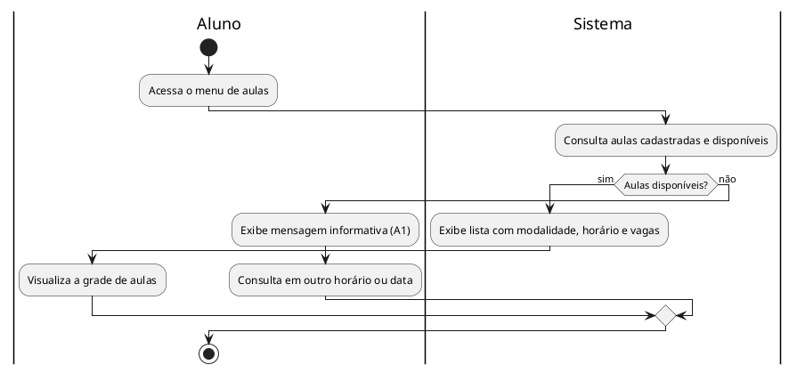

---

## UC09 — Agendar Aula

| Atributo | Descrição |
|---|---|
| **Ator Principal** | Aluno |
| **Objetivo** | Reservar vaga em uma aula disponível. |
| **Pré-condições** | Aula com vaga disponível. |
| **Pós-condições** | Reserva registrada no sistema. |
| **RF Relacionados** | RF06 |
| **RNF Relacionados** | RNF04 |
| **RN Relacionadas** | RN02 |

**Fluxo Principal:**
1. O aluno escolhe a aula.
2. O sistema verifica vagas.
3. O sistema confirma a reserva.

**Fluxos Alternativos:**
- **A1 — Aula lotada:** O sistema bloqueia o agendamento.

### Diagrama de Atividade

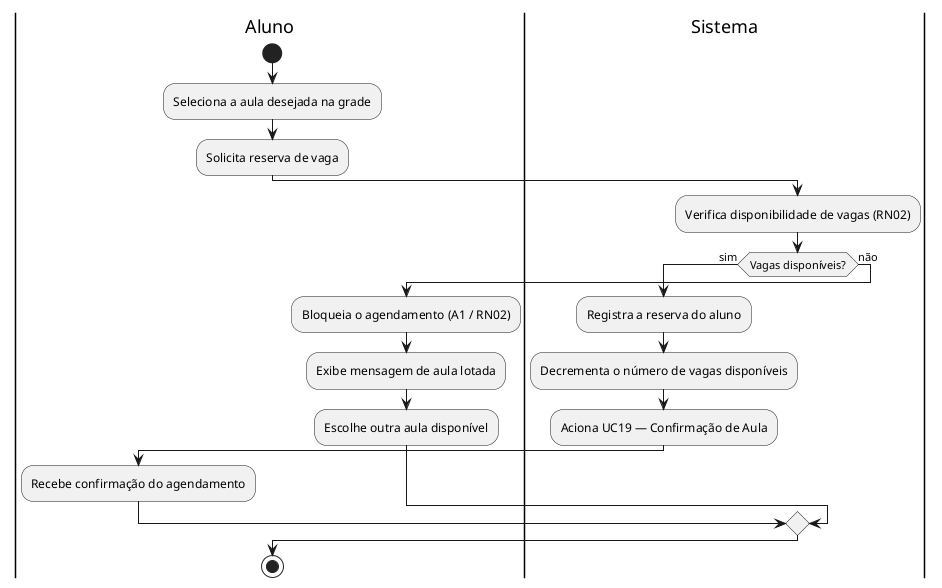

---

## UC10 — Cancelar Agendamento

| Atributo | Descrição |
|---|---|
| **Ator Principal** | Aluno |
| **Objetivo** | Cancelar uma reserva de aula previamente realizada. |
| **Pré-condições** | Aula previamente reservada pelo aluno. |
| **Pós-condições** | Reserva cancelada e vaga liberada. |
| **RF Relacionados** | RF06 |
| **RNF Relacionados** | RNF04 |
| **RN Relacionadas** | RN03 |

**Fluxo Principal:**
1. O aluno acessa suas reservas.
2. O aluno seleciona cancelar.
3. O sistema confirma o cancelamento.

**Fluxos Alternativos:**
- **A1 — Cancelamento fora do prazo:** O sistema bloqueia o cancelamento.

### Diagrama de Atividade

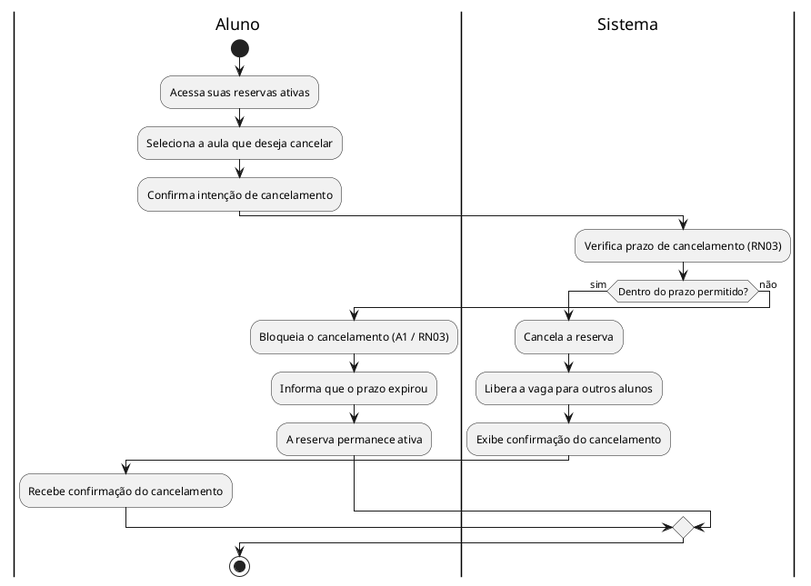

---

## UC11 — Registrar Presença

| Atributo | Descrição |
|---|---|
| **Ator Principal** | Instrutor |
| **Objetivo** | Registrar a presença dos alunos em uma aula. |
| **Pré-condições** | Aula em andamento no sistema. |
| **Pós-condições** | Presenças registradas no histórico dos alunos. |
| **RF Relacionados** | RF07 |
| **RNF Relacionados** | RNF04 |
| **RN Relacionadas** | RN06 |

**Fluxo Principal:**
1. O instrutor acessa a aula.
2. O sistema mostra os alunos inscritos.
3. O instrutor marca a presença.

**Fluxos Alternativos:**
- **A1 — Aluno ausente:** O sistema registra ausência.

### Diagrama de Atividade

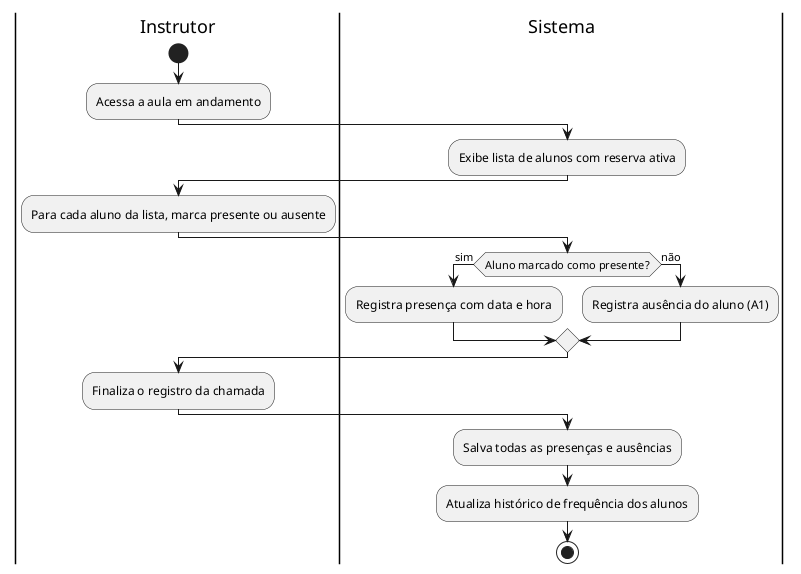

---

## UC12 — Visualizar Lista de Presença

| Atributo | Descrição |
|---|---|
| **Ator Principal** | Instrutor |
| **Objetivo** | Visualizar os alunos inscritos em uma aula. |
| **Pré-condições** | Aula agendada no sistema. |
| **Pós-condições** | Lista de alunos inscritos exibida. |
| **RF Relacionados** | RF07 |
| **RNF Relacionados** | RNF04 |
| **RN Relacionadas** | RN06 |

**Fluxo Principal:**
1. O instrutor seleciona a aula.
2. O sistema exibe os alunos inscritos.

**Fluxos Alternativos:**
- **A1 — Nenhum aluno inscrito:** O sistema informa ao instrutor.

### Diagrama de Atividade

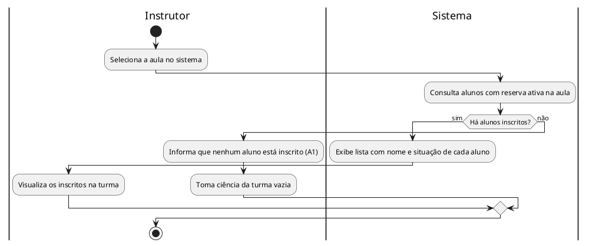

---

## UC13 — Registrar Avaliação Física

| Atributo | Descrição |
|---|---|
| **Ator Principal** | Instrutor |
| **Objetivo** | Registrar dados físicos do aluno no sistema. |
| **Pré-condições** | Aluno ativo no sistema. |
| **Pós-condições** | Avaliação física salva no perfil do aluno. |
| **RF Relacionados** | RF08 |
| **RNF Relacionados** | RNF02 |
| **RN Relacionadas** | RN05 |

**Fluxo Principal:**
1. O instrutor seleciona o aluno.
2. O instrutor registra peso e medidas.
3. O sistema salva os dados.

**Fluxos Alternativos:**
- **A1 — Aluno irregular:** O sistema bloqueia a avaliação.

### Diagrama de Atividade

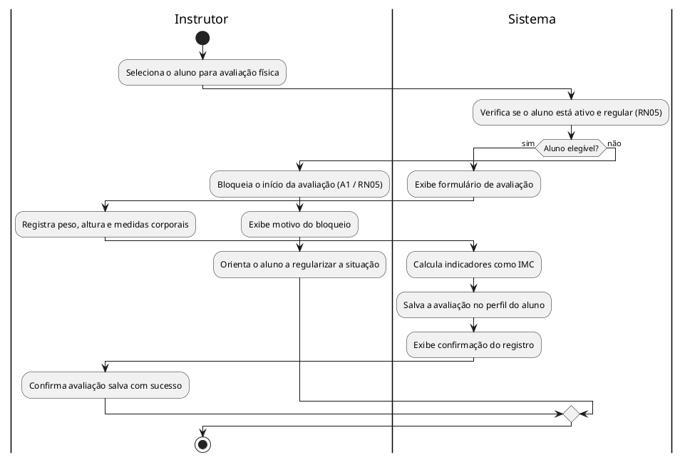

---

## UC14 — Consultar Avaliação Física

| Atributo | Descrição |
|---|---|
| **Ator Principal** | Instrutor |
| **Objetivo** | Consultar avaliações físicas anteriores do aluno. |
| **Pré-condições** | Avaliação física previamente registrada. |
| **Pós-condições** | Histórico de avaliações exibido. |
| **RF Relacionados** | RF08 |
| **RNF Relacionados** | RNF02 |
| **RN Relacionadas** | RN06 |

**Fluxo Principal:**
1. O instrutor busca o aluno.
2. O sistema mostra as avaliações registradas.

**Fluxos Alternativos:**
- **A1 — Nenhuma avaliação registrada:** O sistema informa.

### Diagrama de Atividade

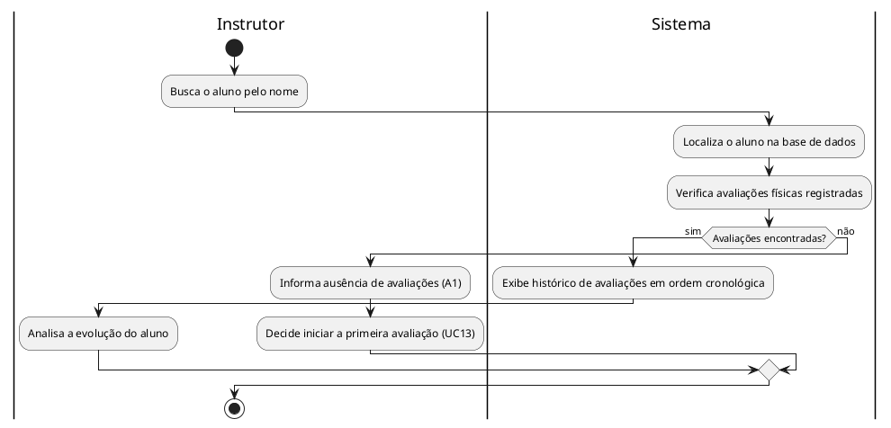

---

## UC15 — Gerar Relatório de Alunos

| Atributo | Descrição |
|---|---|
| **Ator Principal** | Gerente |
| **Objetivo** | Visualizar relatório com os alunos ativos no sistema. |
| **Pré-condições** | Gerente autenticado. |
| **Pós-condições** | Relatório de alunos ativos exibido. |
| **RF Relacionados** | RF09 |
| **RNF Relacionados** | RNF03 |
| **RN Relacionadas** | RN06 |

**Fluxo Principal:**
1. O gerente acessa relatórios.
2. O gerente seleciona alunos ativos.
3. O sistema gera o relatório.

**Fluxos Alternativos:**
- **A1 — Falha na geração:** O sistema informa erro.

### Diagrama de Atividade

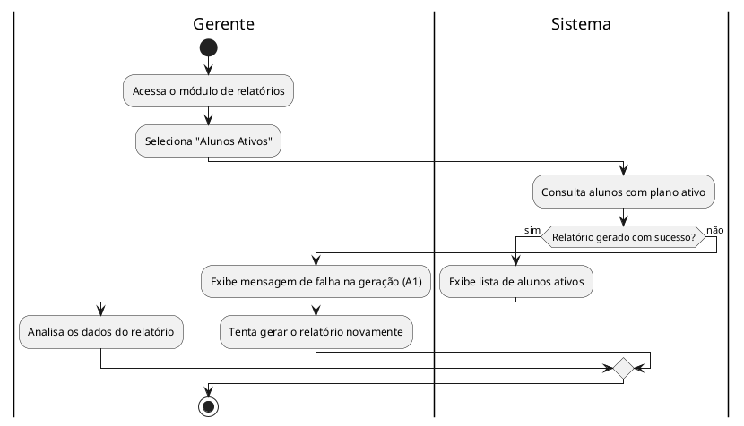

---

## UC16 — Gerar Relatório de Inadimplência

| Atributo | Descrição |
|---|---|
| **Ator Principal** | Gerente |
| **Objetivo** | Visualizar alunos com pagamento em atraso. |
| **Pré-condições** | Gerente autenticado. |
| **Pós-condições** | Relatório de inadimplência exibido. |
| **RF Relacionados** | RF09 |
| **RNF Relacionados** | RNF03 |
| **RN Relacionadas** | RN01 |

**Fluxo Principal:**
1. O gerente acessa relatórios.
2. Seleciona inadimplência.
3. O sistema gera o relatório.

**Fluxos Alternativos:**
- **A1 — Nenhum aluno inadimplente:** O sistema informa.

### Diagrama de Atividade

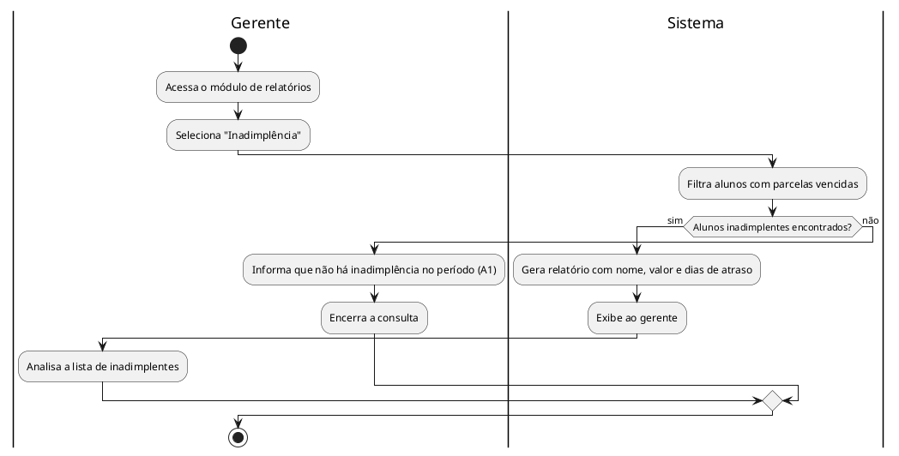

---

## UC17 — Gerar Relatório de Acessos

| Atributo | Descrição |
|---|---|
| **Ator Principal** | Gerente |
| **Objetivo** | Visualizar o histórico de entradas na academia. |
| **Pré-condições** | Gerente autenticado. |
| **Pós-condições** | Relatório de acessos exibido. |
| **RF Relacionados** | RF09 |
| **RNF Relacionados** | RNF03 |
| **RN Relacionadas** | RN06 |

**Fluxo Principal:**
1. O gerente acessa relatórios.
2. Seleciona histórico de acesso.
3. O sistema gera o relatório.

**Fluxos Alternativos:**
- **A1 — Sem registros:** O sistema informa.

### Diagrama de Atividade

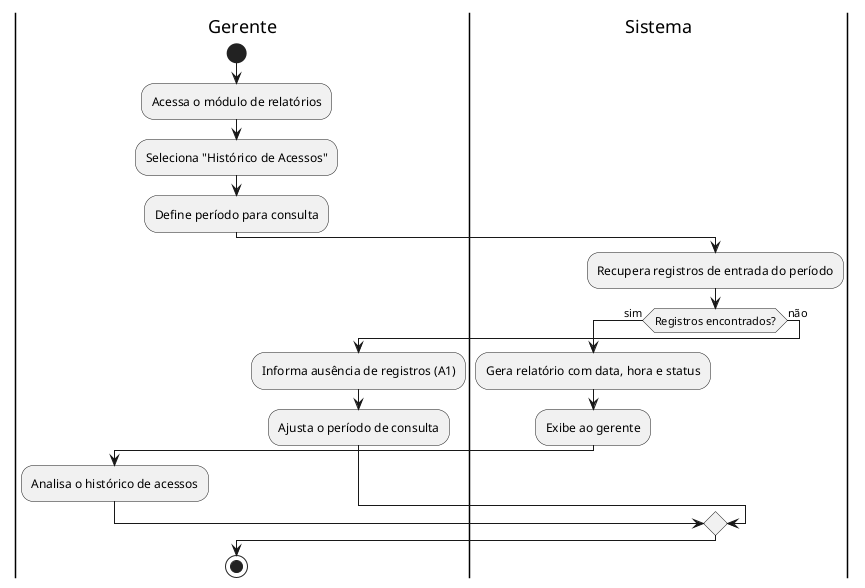

---

## UC18 — Enviar Notificação de Pagamento

| Atributo | Descrição |
|---|---|
| **Ator Principal** | Sistema |
| **Objetivo** | Avisar o aluno sobre o vencimento próximo da mensalidade. |
| **Pré-condições** | Mensalidade próxima do vencimento. |
| **Pós-condições** | Notificação enviada ao aluno. |
| **RF Relacionados** | RF10 |
| **RNF Relacionados** | RNF01 |
| **RN Relacionadas** | RN07 |

**Fluxo Principal:**
1. O sistema identifica mensalidade próxima do vencimento.
2. O sistema envia notificação ao aluno.

**Fluxos Alternativos:**
- **A1 — Falha no envio:** O sistema tenta novamente.

### Diagrama de Atividade

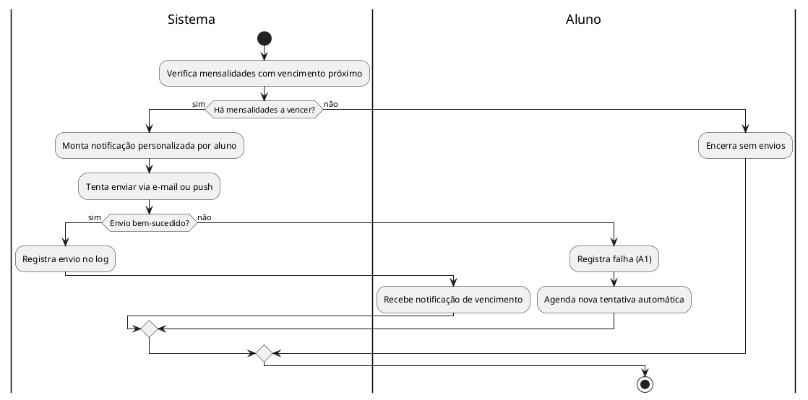

---

## UC19 — Enviar Confirmação de Aula

| Atributo | Descrição |
|---|---|
| **Ator Principal** | Sistema |
| **Objetivo** | Confirmar ao aluno que o agendamento de aula foi realizado. |
| **Pré-condições** | Aula agendada pelo aluno (UC09). |
| **Pós-condições** | Confirmação enviada com detalhes da aula. |
| **RF Relacionados** | RF10 |
| **RNF Relacionados** | RNF01 |
| **RN Relacionadas** | RN02 |

**Fluxo Principal:**
1. O sistema registra o agendamento.
2. O sistema envia confirmação ao aluno.

**Fluxos Alternativos:**
- **A1 — Falha no envio:** O sistema tenta reenviar.

### Diagrama de Atividade

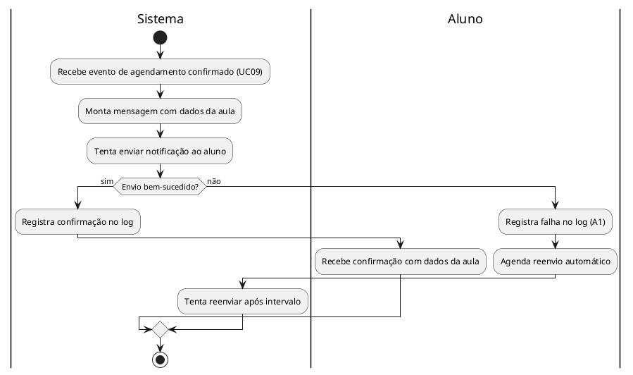

---

## UC20 — Notificar Nova Avaliação Física

| Atributo | Descrição |
|---|---|
| **Ator Principal** | Sistema |
| **Objetivo** | Informar ao aluno que uma nova avaliação física está disponível. |
| **Pré-condições** | Avaliação anterior já registrada no sistema. |
| **Pós-condições** | Notificação de nova avaliação enviada ao aluno. |
| **RF Relacionados** | RF10 |
| **RNF Relacionados** | RNF01 |
| **RN Relacionadas** | RN05 |

**Fluxo Principal:**
1. O sistema identifica necessidade de nova avaliação.
2. O sistema envia notificação ao aluno.

**Fluxos Alternativos:**
- **A1 — Falha no envio:** O sistema tenta novamente.

### Diagrama de Atividade

```plantuml
@startuml DA_UC20_NotificarNovaAvaliacao

|Sistema|
start
:Verifica alunos com avaliação física vencida ou pendente;

if (Há alunos para notificar?) then (sim)
  :Monta notificação informando disponibilidade;
  :Tenta enviar ao aluno;

  if (Envio bem-sucedido?) then (sim)
    :Registra envio no log;
    |Aluno|
    :Recebe notificação de nova avaliação disponível;
  else (não)
    :Registra falha (A1);
    :Agenda nova tentativa;
  endif
else (não)
  :Encerra sem envios pendentes;
endif

stop
@enduml
```

---

*Documento elaborado por Maycon Gabriel da Silva Morelli (24001786) — UNIFEOB 2026.*
